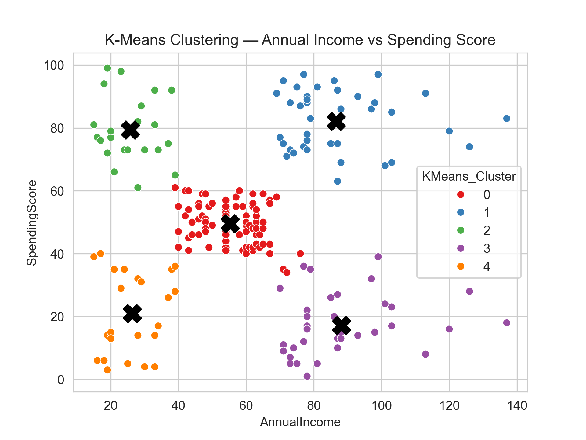
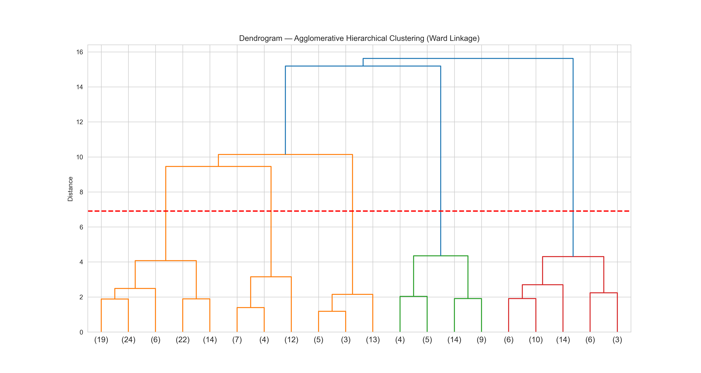
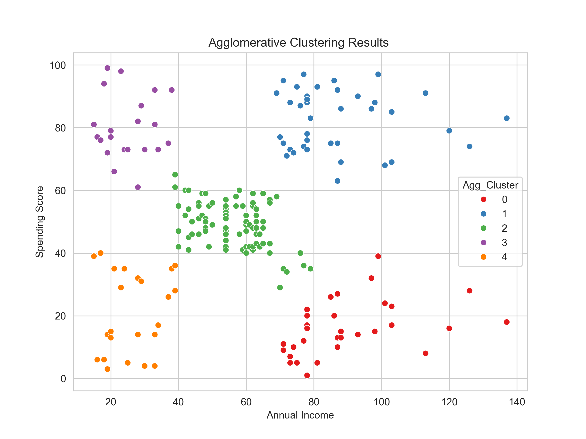
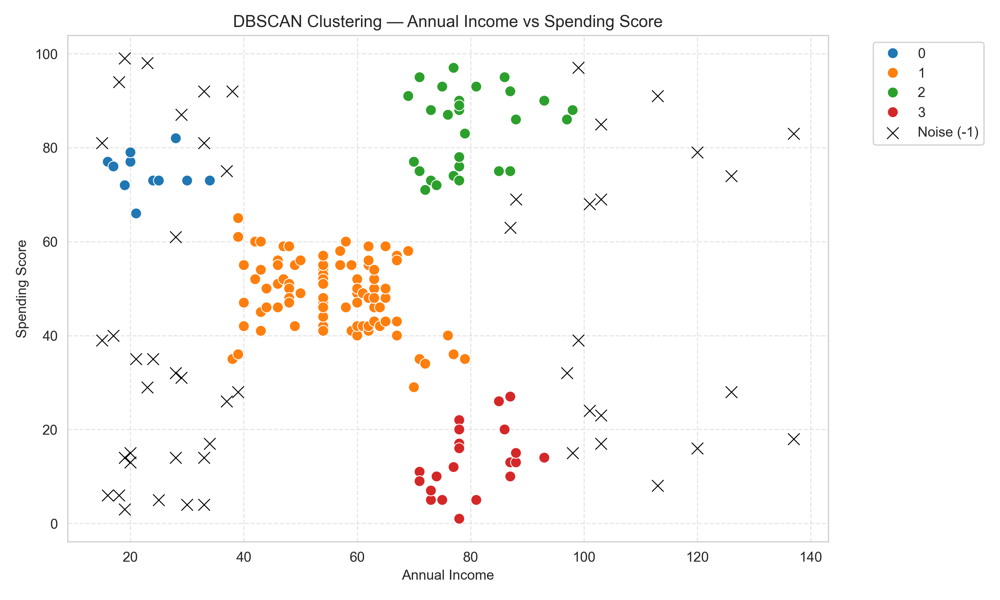

> **Try it out live:** 
>[![Streamlit App]](https://mallshopperprofiling-6ah2wdyqtkejkpsryiklb3.streamlit.app/)

# Customer Segmentation Analysis

This repository contains the Exploratory Data Analysis (EDA) and clustering models applied to a Mall Customer dataset. The goal of this project is to segment customers based on their annual income and spending behaviors to identify distinct target groups for marketing strategies.

---

## 📊 Exploratory Data Analysis (EDA) Summary

Before applying machine learning algorithms, the dataset was cleaned and explored to understand the underlying distributions.

### Data Cleaning & Preparation
* The `CustomerID` column was dropped as it serves only as an identifier.
* Columns were renamed for easier programmatic access (`AnnualIncome`, `SpendingScore`).
* The final dataset consists of **200 entries** and 4 features: `Gender`, `Age`, `AnnualIncome`, and `SpendingScore`.
* No significant outliers were detected in the numerical features.

### Numerical Dataset Statistics
| Feature | Minimum | Mean | Maximum |
| :--- | :--- | :--- | :--- |
| **Age** | 18.00 | 38.85 | 70.00 |
| **Annual Income (k$)** | 15.00 | 60.56 | 137.00 |
| **Spending Score (1-100)** | 1.00 | 50.20 | 99.00 |

### Categorical Distribution
The customer base is predominantly female, with a roughly 60-40 split:
* **Female:** 112 customers
* **Male:** 88 customers

### Key Distribution Insights
* **Age:** Customer ages peak between 30 and 35, with a notable secondary spike among younger shoppers (18–20).
* **Annual Income:** Follows a slightly right-skewed normal distribution, with the bulk of shoppers earning between $40k and $80k.
* **Spending Score:** Displays a massive central peak around 40 to 50, indicating a large group of average spenders, while the rest of the distribution is relatively uniform.

---

## 🤖 Clustering Models & Results

To effectively segment the customers, three different clustering algorithms were applied to the `AnnualIncome` and `SpendingScore` features.

### 1. K-Means Clustering
K-Means successfully partitioned the customer base into **5 distinct clusters**. The black 'X' marks indicate the centroids of each cluster, clearly defining groups such as high-income/high-spending and low-income/low-spending.

### 2. Agglomerative Hierarchical Clustering
Using Ward's linkage method, we constructed a dendrogram to determine the optimal number of clusters based on distance. 

Cutting the dendrogram at the indicated threshold yielded **5 clusters**, corroborating the results found via K-Means.

### 3. DBSCAN (Density-Based Spatial Clustering of Applications with Noise)
DBSCAN was utilized to identify dense regions of customers while isolating outliers. This algorithm identified **4 core clusters** and successfully flagged anomalous data points as noise (marked with 'X').

---

## 💡 Conclusion
The analysis consistently reveals the presence of distinct customer segments, heavily driven by the relationship between Annual Income and Spending Score. The 5-cluster model (confirmed by both K-Means and Hierarchical Clustering) provides the most actionable framework for targeted marketing campaigns, allowing the business to isolate "target" customers (high income, high spend) and "cautious" customers (high income, low spend).
